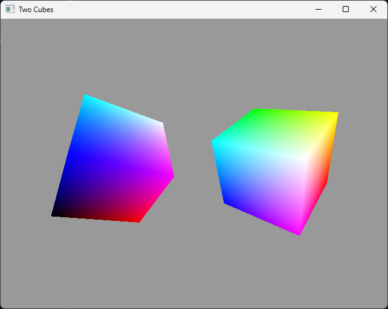

# Two Cubes

This example shows some of the alignment requirements involved when updating and binding multiple
slices of a uniform buffer. It renders two rotating cubes which have transform matrices at
different offsets in a uniform buffer.

## Running

To build and run this example:

```shell
build.bat|sh 07_two_cubes run
```

## Screenshots


