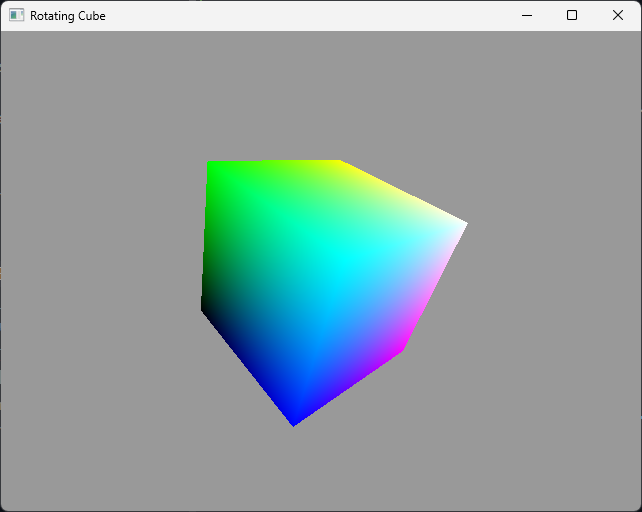
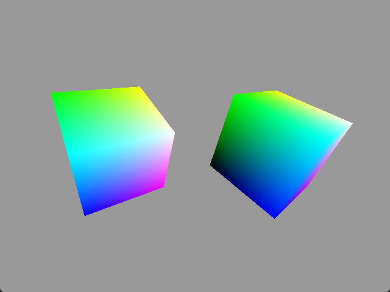
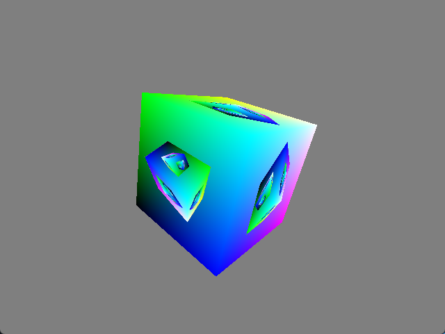
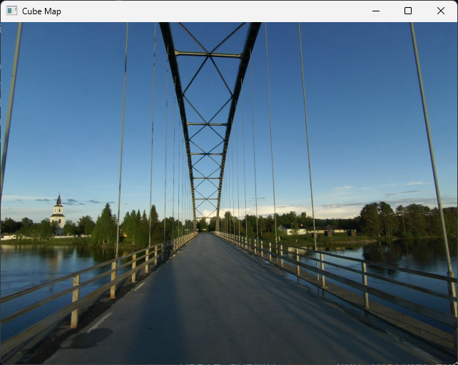
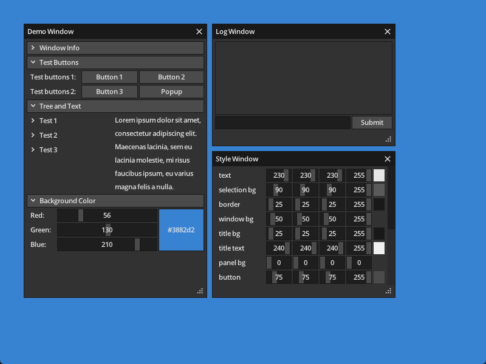

# Examples

## Table of Contents

- [Info](#info)
- [Clear Screen](#clear-screen)
- [Triangle](#triangle)
- [Square](#square)
- [Blend](#blend)
- [Stencil Triangles](#stencil-triangles)
- [Cube](#cube)
- [Rotating Cube](#rotating-cube)
- [Two Cubes](#two-cubes)
- [Fractal Cube](#fractal-cube)
- [Cube Textured](#cube-textured)
- [OBJ Model](#obj-model)
- [Cubemap](#cubemap)
- [MicroUI](#microui)

## [Info](./info)

Print current version and selected adapter information.

## [Clear Screen](./clear_screen)

This example demonstrates how to clear the screen.

## [Triangle](./triangle)

This example demonstrates how to render a colored triangle with smooth color interpolation between
vertices.

## [Square](./square)

This example demonstrates how to render a colored square with smooth color interpolation between
vertices.

## [Blend](./blend)

This example shows blending in sRGB or linear space.

## [Stencil Triangles](./stencil_triangles)

This example shows using the stencil buffer for masking.

## [Cube](./cube)

This example demonstrates how to render a colored cube.

## [Rotating Cube](./rotating_cube)

This example shows how to upload uniform data every frame to render a rotating object.

## [Two Cubes](./two_cubes)

This example shows some of the alignment requirements involved when updating and binding multiple
slices of a uniform buffer. It renders two rotating cubes which have transform matrices at
different offsets in a uniform buffer.

## [Fractal Cube](./fractal_cube)

This example uses the previous frame's rendering result as the source texture for the next frame.

## [Cube Textured](./cube_textured)

This example demonstrates how to render a textured cube.

## [OBJ Model](./obj_model)

This example demonstrates how to load a `OBJ` model using tobj (tinyobjloader).

## [Cubemap](./cubemap)

This example shows how to render and sample from a cubemap texture. 

## [MicroUI](./microui)

This example demonstrates how to use MicroUI with a custom renderer.

